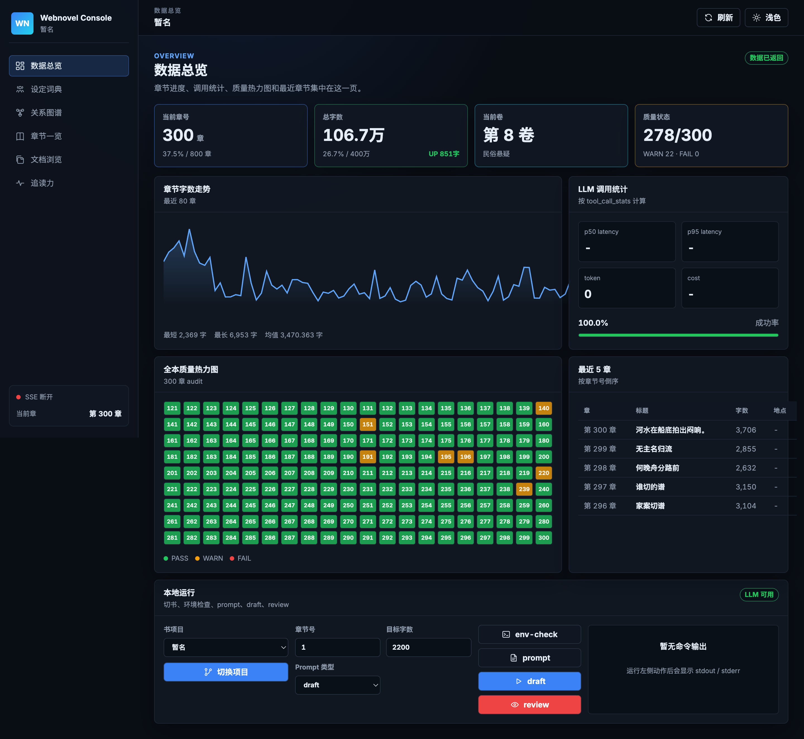

# xuanji-write

[](LICENSE)
[](https://www.python.org/)
[](https://github.com/MRXOAD/xuanji-write/actions/workflows/ci.yml)
[](https://github.com/MRXOAD/xuanji-write/releases)

中文长篇网文 LLM 续写框架。一本《香灰照骨》已经写到 300 章 / 106.7 万字。单章 28 秒,deepseek-chat 单章 $0.003-$0.01。



## 这工具解决什么

写长篇 LLM 容易忘:第 30 章死了的人第 143 章又出现,主角名字被改成同姓变体,题材是民俗悬疑写着写着冒出"丹田"。这框架在 11 个地方堵这种漂移,每章生成完自动跑正则审查 + LLM fact-check,出错就重写一次。

## 一分钟跑通 demo

```bash
git clone https://github.com/MRXOAD/xuanji-write.git
cd xuanji-write
pip install -r requirements.txt

# 复制 demo 起步
cp -r examples/demo-都市悬疑 ~/my-novel
cd ~/my-novel

# 配 .env(写正文最少这 3 行)
cat > .env <<EOF
LLM_BASE_URL=https://api.deepseek.com
LLM_CHAT_MODEL=deepseek-chat
DEEPSEEK_API_KEY=sk-xxx
EOF

# 写第 1 章(demo 自带前 3 章细纲 + 实跑正文)
python webnovel-writer/scripts/webnovel.py llm draft --chapter 4

# 实时面板看进度
streamlit run webnovel-writer/dashboard_vibe.py -- --project-root .
# 浏览器开 http://localhost:8866
```

或者用 Docker 一键起 fastapi + streamlit:

```bash
cp .env.docker.example .env  # 填 DEEPSEEK_API_KEY
mkdir -p books && cp -r examples/demo-都市悬疑 books/default
docker-compose up
```

## 实测数

| 指标 | 数 |
|---|---|
| 已写 | 300 章 / 106.7 万字 |
| 单章生成 | 28 秒 (deepseek-chat) |
| 单章成本 | $0.003 - $0.01 |
| 全本审查 | 0.3 秒 (300 章 × 7 类正则) |
| 一次跑 69 章失败章节 | 2 章(都是 API 断流,重跑成功) |
| 单元测试 | 225 个,GitHub Actions Python 3.10 / 3.12 矩阵 |

## 11 层一致性堵漏

写 800 章的难点不是写得快,是不让它忘。每一层独立生效,挂掉一层不影响其他:

1. **Story System 主合约**(`设定集/故事合约.md`) — 全书宪法,核心冲突 / 主角弧 / 反派弧 / 节奏 / 写作纪律,优先级高于单章细节
2. **角色锚点**(`设定集/角色约束.md`) — 每行一条角色定义,自动注入 system prompt
3. **大纲驱动** — 每章必须有 `大纲/第NNN章-XXX.md`,缺则从 `*阶段支架.md` 表格自动生成降级版
4. **长程上下文混合** — 近 2 章 + 卷头章 + 跨段锚点 + quest 主线 + 未回收伏笔的源章
5. **卷头 transition 注入** — 写卷头章时叠加上一卷尾章摘要 + 新卷阶段支架,防止情绪 / 节奏断链
6. **角色对白样本** — 从已写章节抽该角色的对白模式,挑 4 条注入(每 30 章自动刷新)
7. **章末 audit 正则** — 7 类:修仙词 / 主角名串稿 / 元信息漏字 / 死活状态 / 字数异常 / 自造姓氏 / 姐姐错名
8. **audit 失败自动 retry** — 错误清单注入 user prompt 重写一次
9. **伏笔自动追踪** — 用监控小 LLM 提"引入悬念 + 兑现旧悬念",超 20 章未推进的回写到下章
10. **L2 / L3 自动检查** — `chapter%10` 跑章级 fact-check,`chapter%80` 跑 20 章段级 review,异常落 `审查报告/`
11. **RAG 反向检索** — 大纲跟历史章节相似度 ≥ 0.7 视为"已写过",反向注入"避免桥段复读"

写章前自带 4 项预检(大纲存在 / 角色匹配 / 卷号一致 / API 配置),不过预检自动跑可用 `--no-preflight` 关。详见 [`docs/long-term-consistency.md`](docs/long-term-consistency.md)。

## 配 LLM

`.env` 写正文最小配置:

```bash
LLM_BASE_URL=https://api.deepseek.com
LLM_CHAT_MODEL=deepseek-chat
LLM_REASONING_MODEL=deepseek-reasoner
DEEPSEEK_API_KEY=sk-xxx
```

**写作 / 监控分两套 API**(可选,省 6 倍以上成本)。监控指伏笔抽取 / L2 章级 / L3 段级,跑频率高,挂便宜小模型即可:

```bash
# 写作 deepseek-chat($0.27/M),监控 qwen-turbo($0.04/M)
MONITORING_BASE_URL=https://dashscope.aliyuncs.com/compatible-mode/v1
MONITORING_CHAT_MODEL=qwen-turbo-latest
MONITORING_API_KEY=sk-xxx
```

不配 `MONITORING_*` 自动 fallback 到 writing API。支持网关回退、ModelScope embedding、Jina rerank,详见 [`docs/codex-llm.md`](docs/codex-llm.md)。

## 实时面板

两套面板,任选:

**Streamlit "vibe" 进度面板**(8866 端口,5 秒刷新):
- 顶部 4 个 KPI:章号 / 字数 / 卷号 / 进度条
- 章节字数折线 + LLM 调用统计(p50/p95 latency / token / cost)
- 全本质量热力图 20×N(绿 PASS / 黄 WARN / 红 FAIL)
- 未回收伏笔散点图(纵轴 = 距今多少章未推进)
- 章末钩子分布 + L2/L3 检查报告分类

**React + FastAPI dashboard**(8000 端口,30+ 端点 + SSE 实时):
- 数据总览 / 设定词典 / 关系图谱(force-graph 3D)/ 章节一览 / 文档浏览 / 追读力

```bash
streamlit run webnovel-writer/dashboard_vibe.py -- --project-root <BOOK>
python -m webnovel-writer.dashboard.server --project-root <BOOK> --port 8000
```

## CLI 速查

```bash
# 写作
webnovel.py llm draft --chapter 1                            # 单章,自带预检 + audit retry
webnovel.py llm batch-draft --from-chapter 1 --to-chapter 20 --parallel 3 --skip-on-error

# 检查 / 维护
python scripts/preflight.py --project-root <BOOK> --chapter 232
python scripts/draft_audit.py --project-root <BOOK> --chapter 250
python scripts/check_pipeline.py --project-root <BOOK> --chapter 240    # 自动选 L1/L2/L3
python scripts/llm_stats.py --project-root <BOOK> --by-task             # token + cost
python scripts/extract_character_voice.py --project-root <BOOK>         # 手动刷新对白样本
python scripts/foreshadowing_tracker.py --project-root <BOOK> --list-open --max-age 30

# state 修
python scripts/update_state.py --project-root <BOOK> --set-genre "民俗悬疑"
python scripts/update_state.py --project-root <BOOK> --audit-volumes    # 卷号自校准

# RAG 索引
python scripts/data_modules/rag_adapter.py --project-root <BOOK> rebuild-all
```

环境变量(都可在 `.env` 配):

| 变量 | 默认 | 说明 |
|---|---|---|
| `WEBNOVEL_AUTO_CHECK` | `L2` | `L2` / `L3` / `off`,控制写完一章后自动跑哪一档 |
| `WEBNOVEL_FORESHADOWING_AUTO` | `1` | `0` 关闭伏笔自动追踪 |
| `WEBNOVEL_VOICE_AUTO` | `1` | `0` 关闭对白样本自动刷新 |
| `WEBNOVEL_VOICE_INTERVAL` | `30` | 对白样本刷新间隔(章) |

## examples

- [`examples/demo-玄幻短篇/`](examples/demo-玄幻短篇/) 修仙模板,沈砚之 / 青鸾宗,3 章细纲 + 故事合约
- [`examples/demo-都市悬疑/`](examples/demo-都市悬疑/) 现代连环案,陈晓白 / 网约车,**带 3 章实跑正文 + 故事合约**

## 跟同类项目比

| | xuanji-write | webnovel-writer 上游 v6.0 | AI_NovelGenerator | autonovel |
|---|---|---|---|---|
| 章末规则审查 + 失败 retry | ✓ | ✗ | 部分 | ✗ |
| 多 LLM 路由 fallback | ✓ | ✗ | ✗ | ✗ |
| **写作 / 监控分两套 API** | ✓ | ✗ | ✗ | ✗ |
| 全本质量热力图 | ✓ | ✗ | ✗ | ✗ |
| token / cost 自动统计 | ✓ | ✗ | ✗ | ✗ |
| 角色对白样本注入 + 自动刷新 | ✓ | ✗ | character_state | ✗ |
| 伏笔自动追踪 | ✓ | ✗ | ✗ | propagation debt |
| 长程上下文混合(5 类来源 + 卷头 transition) | ✓ | ✓ | ✗ | ✓ |
| Story System 主合约 | ✓ | ✓ | ✗ | 五层共演化 |
| **RAG 反向检索防桥段复读** | ✓ | ✗ | ✗ | ✗ |
| L2 / L3 自动分级检查 | ✓ | 部分 | ✗ | ✗ |
| Docker compose 一键起 | ✓ | ✗ | ✗ | ✗ |
| 多 agent 协作 | ✗ | ✗ | ✗ | ✓ |

## 文档

- [`docs/long-term-consistency.md`](docs/long-term-consistency.md) — 11 层一致性方案
- [`docs/architecture.md`](docs/architecture.md) — 架构与模块
- [`docs/commands.md`](docs/commands.md) — 命令详解
- [`docs/codex-llm.md`](docs/codex-llm.md) — Codex 集成 + LLM 配置(网关 / 监控分流)
- [`docs/rag-and-config.md`](docs/rag-and-config.md) — RAG 索引
- [`docs/genres.md`](docs/genres.md) — 题材模板
- [`docs/operations.md`](docs/operations.md) — 运维和恢复
- [`docs/workspace.md`](docs/workspace.md) — 工作区布局

## 致谢

Fork 自 [`lingfengQAQ/webnovel-writer`](https://github.com/lingfengQAQ/webnovel-writer),保留 GPL v3。Story System 概念借鉴上游 v6.0,章末规则审查思路借鉴 autonovel 的 propagation debt,dashboard 视觉对标 wandb / linear / vercel。

## License

GPL v3,继承自上游。详见 [LICENSE](LICENSE)。
